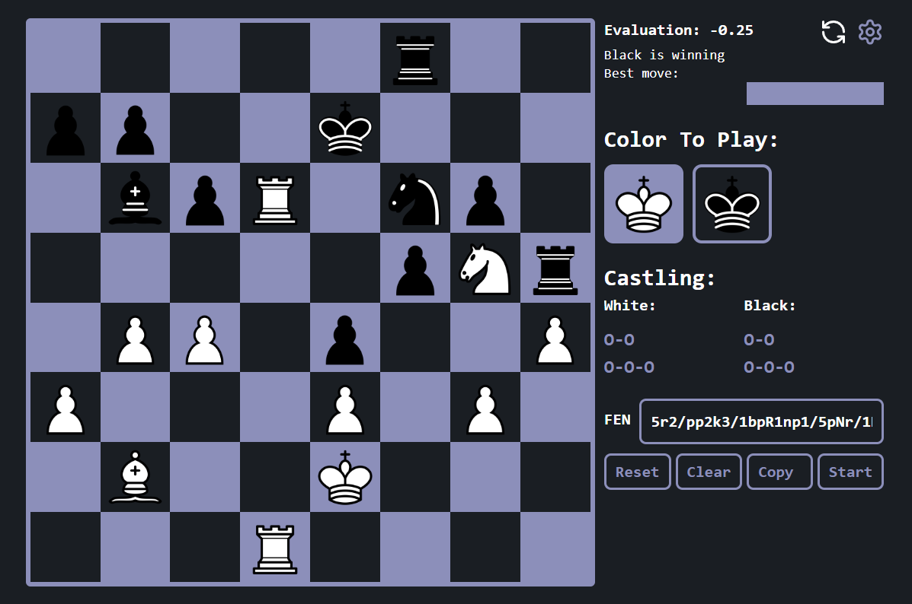
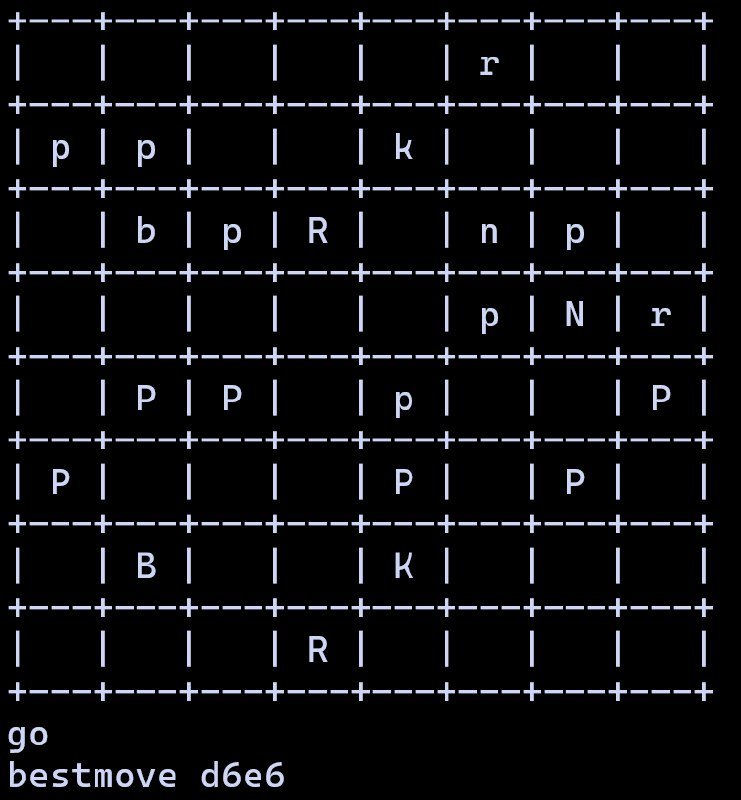

# Python Chess Engine
### This repository Represents Core logic The Engine 

### Engine could be used in multiple ways:
  - **CLI tool** - Use UCI commands to interact directly via the command line.
  - **React Web Application** - Part of a larger project with three repositories:
    - **[ChessEngineCore](https://github.com/ShrewdLuni/ChessEngineCore)**     - The engine core (this repository).
    - **[ChessEngineFrontend](https://github.com/ShrewdLuni/ChessEngineFrontend)** - A React & TypeScript web GUI communicating via WebSockets.
    - **[ChessEngineBackend](https://github.com/ShrewdLuni/ChessEngineBackend)**  - A Django backend that bridges the engine and frontend using Django Channels.
  - **Custom Integration** - Provides a flexible Python API for developers to integrate into other applications.


# Table Of Contents
- ### [Engine Structure](#Engine-Structure)
- ### [UCI Engine Usage](#UCI-Usage-Guide)
- ### [Python Engine API Usage](#engine-api-usage-guide)
- ### [In Code Engine Usage](#engine-class-usage-guide)

# Engine Structure

```bash
/Chess Engine
├── board.py                 # Handles the board setup and state
├── board_utility.py         # Utility functions for board manipulation
├── engine.py                # Python Engine API
├── engine_uci.py            # UCI (Universal Chess Interface) protocol support
├── evaluation.py            # Evaluation function for board positions
├── main.py                  # Entry point to run the engine CLI
├── move.py                  # Move Class
├── move_flags.py            # Move Flags
├── move_generator.py        # Logic for generating possible moves
├── piece.py                 # Piece Info
├── piece_square_table.py    # Piece-square tables for evaluation
├── precomputed_move_data.py # Precomputed data for move generation
├── search_function.py       # Search algorithm for move decision-making
├── __init__.py              # Initialization for the module (empty file)

```

# UCI Usage Guide



## Introduction
The Universal Chess Interface (UCI) is a standard text-based protocol used to communicate with a chess engine and is the recommended way to do so for typical graphical user interfaces (GUI) or chess tools. 

To run Engine CLI tool use this:
```
py main.py
```

## Standard Commands 

### 1. `uci`
- Initializes the engine and confirms support for UCI.
```bash
> uci
uciok
```

### 2. `isready`
- Checks if the engine is ready.
```bash
> isready
readyok
```

### 3. `ucinewgame`
- Resets the engine for a new game.
```bash
> ucinewgame
```

### 4. `position`
- Sets up a position on the board.
- **Usage:** `position [fen <fenstring> | startpos ] moves <move1> .... <movei>`
```bash
> position startpos
> position startpos moves e2e4 e7e5 g1f3 b8c6 f1b5
> position fen 8/1B6/8/5p2/8/8/5Qrq/1K1R2bk w - - 0 1
> position fen 8/3P3k/n2K3p/2p3n1/1b4N1/2p1p1P1/8/3B4 w - - 0 1 moves g4f6 h7g7 f6h5 g7g6 d1c2
```

### 5. `go`
- Starts the search and returns the best move.
  - **Note:** The Engine performes bestmove, changing position
- **Usage:** `go [time]`
  - If no time is provided, the engine will search for 2 seconds by default.
```bash
> go
bestmove b1b3
> go 20
bestmove e2e4
> go 0.5
bestmove b1c3
> go 0.01
bestmove b1c3
```

### 6. `perft`
- Performs a perft (performance test) up to a given depth.
- Displays perft statistics including nodes searched and move counts.
- **Usage:** `perft [depth]`
  - If depth is not provided, the engine will perform test for depth 3.
```bash
> perft 4
a2a3: 8457
a2a4: 9329
b1a3: 8885
b1c3: 9755
b2b3: 9345
b2b4: 9332
c2c3: 9272
c2c4: 9744
d2d3: 11959
d2d4: 12435
e2e3: 13134
e2e4: 13160
f2f3: 8457
f2f4: 8929
g1f3: 9748
g1h3: 8881
g2g3: 9345
g2g4: 9328
h2h3: 8457
h2h4: 9329

Nodes searched: 197281

Depth: 4
Elapsed time: 15.03 seconds
Speed: 13.13 thousand positions per second (KPS)
```
### 7. `d`
- Display the current position, with ASCII art and FEN.
- **Usage:** `d [wide]`
  - Changes board aspect ratio to wider one on `wide` option `d wide` 
 ```bash
 > d
 rnbqkbnr/pppppppp/8/8/8/8/PPPPPPPP/RNBQKBNR w KQkq - 0 1
+---+---+---+---+---+---+---+---+
| r | n | b | q | k | b | n | r |
+---+---+---+---+---+---+---+---+
| p | p | p | p | p | p | p | p |
+---+---+---+---+---+---+---+---+
|   |   |   |   |   |   |   |   |
+---+---+---+---+---+---+---+---+
|   |   |   |   |   |   |   |   |
+---+---+---+---+---+---+---+---+
|   |   |   |   |   |   |   |   |
+---+---+---+---+---+---+---+---+
|   |   |   |   |   |   |   |   |
+---+---+---+---+---+---+---+---+
| P | P | P | P | P | P | P | P |
+---+---+---+---+---+---+---+---+
| R | N | B | Q | K | B | N | R |
+---+---+---+---+---+---+---+---+

> d wide
rnbqkbnr/pppppppp/8/8/8/8/PPPPPPPP/RNBQKBNR w KQkq - 0 1
+-----+-----+-----+-----+-----+-----+-----+-----+
|  r  |  n  |  b  |  q  |  k  |  b  |  n  |  r  |
+-----+-----+-----+-----+-----+-----+-----+-----+
|  p  |  p  |  p  |  p  |  p  |  p  |  p  |  p  |
+-----+-----+-----+-----+-----+-----+-----+-----+
|     |     |     |     |     |     |     |     |
+-----+-----+-----+-----+-----+-----+-----+-----+
|     |     |     |     |     |     |     |     |
+-----+-----+-----+-----+-----+-----+-----+-----+
|     |     |     |     |     |     |     |     |
+-----+-----+-----+-----+-----+-----+-----+-----+
|     |     |     |     |     |     |     |     |
+-----+-----+-----+-----+-----+-----+-----+-----+
|  P  |  P  |  P  |  P  |  P  |  P  |  P  |  P  |
+-----+-----+-----+-----+-----+-----+-----+-----+
|  R  |  N  |  B  |  Q  |  K  |  B  |  N  |  R  |
+-----+-----+-----+-----+-----+-----+-----+-----+
 ```


### 8. `quit`
- Exits the engine.
```bash
> quit
```

### 9. `cls` / `clear`
- Clears the terminal screen.
```bash
> cls
> clear
```

## Example Session
```
> uci
uciok
> isready
readyok
> position startpos moves e2e4 e7e5
> go 2.0
bestmove e2e4
> quit
```

# Engine API Usage Guide

## Introduction
The `Engine` class provides a programmatic interface for interacting with the chess engine, allowing users to set up positions, generate moves, evaluate board states, and more.

## Initialization
To use the chess engine, instantiate the `Engine` class:

```python
from ChessEngine.engine import Engine

engine = Engine()
```

## Standard Methods

### 1. `new_game`
- Resets the engine for a new game.
```python
engine.new_game()
```

### 2. `set_position`
- Sets up a position on the board.
```python
fen = "rnbqkbnr/pppppppp/8/8/8/8/PPPPPPPP/RNBQKBNR w KQkq - 0 1"
engine.set_position(fen)
```

### 3. `get_fen`
- Retrieves the current board position in FEN format.
```python
current_fen = engine.get_fen()
print(current_fen) # rnbqkbnr/pppppppp/8/8/8/8/PPPPPPPP/RNBQKBNR w KQkq - 0 1
```

### 4. `make_move`
- Makes a move on the board.
- **Note:** The board is indexed from 0 (top-left, a8) to 63 (bottom-right, h1).
  - Example: `a8` -> `0`, `c8` -> `2`, `a6` -> `16`, `d1` -> `59`
```Python
Move Flags:
  0 # Normal move
  1 # En passant capture
  2 # Castling
  3 # Promote to Queen
  4 # Promote to Knight
  5 # Promote to Rook
  6 # Promote to Bishop
  7 # Pawn two squares forward
```

```python
starting_square = 52  # Example: e2
target_square = 36    # Example: e4
engine.make_move(starting_square, target_square)
```

### 5. `unmake_move`
- Undoes the last move made.
```python
engine.unmake_move()
```

### 6. `is_checkmate`
- Checks if the game is in a checkmate state.
```python
if engine.is_checkmate():
    print("Checkmate!")
```

### 7. `get_legal_moves`
- Retrieves all legal moves for the current position.
```python
legal_moves = engine.get_legal_moves()
print(legal_moves) # [<ChessEngine.move.Move object at 0x0000026286455B40>, <ChessEngine.move.Move object at 0x0000026286455B70>]
```

### 8. `get_random_move`
- Makes a random legal move.
```python
random_move = engine.get_random_move()
print(random_move) # <ChessEngine.move.Move object at 0x0000026286456E90>
```

### 9. `get_best_move`
- Gets the best move using the engine's search function.
- **Usage:** `get_best_move(search_time=2.0)`
```python
best_move_info = engine.get_best_move(search_time=2.0)
print(best_move_info) # {"move": ChessEngine.move.Move object at 0x0000026286456E90>, "evaluation": 1}
```

### 10. `get_current_evaluation`
- Evaluates the current board position.
```python
evaluation = engine.get_current_evaluation()
```

### 11. `move_generation_test`
- Performs a move generation test for a given depth. Same as UCI perft
- **Usage:** `move_generation_test(depth, is_root=False)`
```python
depth = 3
result = engine.move_generation_test(depth, is_root=True)
print(result)
```

## Example Session
```python
engine.new_game()
engine.make_move(52, 36)
print(engine.get_fen())
if engine.is_checkmate():
    print("Game over!")
```